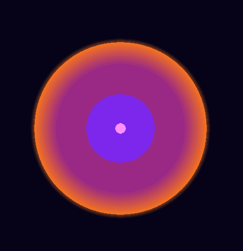

# Chaos Simulator
English | [中文](README_zh.md)

## About this project

This is a **physical simulator** project. In the simulator, there are some bodies that move and absorb following certain physical rules. In the future, **I'll probably add sentient bodies (AI controlled bodies) into the simulator**.

 Currently I use spare time to work on this project, and this is just for fun! :grin:

### Physical simulation functions

Currently, the following functions are implemented  in some versions of the simulator (ticked) or scheduled (blank). ***Some functions maybe aren't integrated normatively, because this is a test project. I'll rebuild the program if it's necessary.***

- [x] basic motion that follows Newton's first law
- [x] border bouncing
- [x] gravitation simulating
- [x] absorbing that is not very exact
- [ ] absorbing that is exact enough
- [ ] repulsive force simulating

